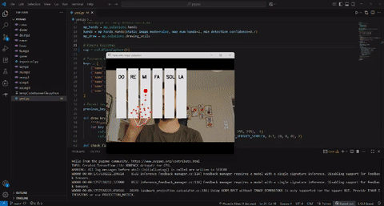

# 🎹 Kamera Kontrollü Sanal Piyano

Bu proje, **kamera ile el takibi** kullanarak piyano notalarını çalmanı sağlayan bir uygulamadır. Bilgisayar kamerası üzerinden **işaret parmağı ucu** algılanır ve ekranda tanımlı tuşlara denk geldiğinde ilgili nota çalınır.  

Projede **OpenCV**, **MediaPipe** ve **Pygame** teknolojileri kullanılmıştır.  

---

## 🎥 Çalışma Örneği



---

## 🚀 Özellikler

- 👆 **El Takibi**: MediaPipe ile işaret parmağı ucu gerçek zamanlı takip edilir.  
- 🎵 **Gerçek Nota Sesleri**: `do.mp3`, `re.mp3`, `mi.mp3`, `fa.mp3`, `sol.mp3`, `la.mp3` dosyaları kullanılarak doğru sesler çalınır.  
- 🎹 **Sanal Tuşlar**: Ekranda görsel olarak piyano tuşları çizilir.  
- 🖱️ **Temassız Kontrol**: Fiziksel klavye olmadan sadece parmağını kameraya tutarak piyano çalabilirsin.  
- 🛑 **Tekrar Önleme**: Bir tuş üzerinde parmak tutulduğunda ses tekrar tekrar çalmaz.  

---

## 📂 Proje Yapısı

```
.
├── yeni.py          # Ana Python dosyası
├── do.mp3           # Nota ses dosyaları
├── re.mp3
├── mi.mp3
├── fa.mp3
├── sol.mp3
├── la.mp3
├── output.gif       # Çalışma örneği animasyonu
└── README.md        # Proje açıklaması
```

---

## ⚙️ Kurulum

1. Gerekli kütüphaneleri yükle:
   ```bash
   pip install opencv-python mediapipe pygame
   ```

2. Nota ses dosyalarının (`do.mp3`, `re.mp3`, vb.) aynı klasörde bulunduğundan emin ol.

---

## ▶️ Çalıştırma

```bash
python yeni.py
```

- Ekranda sanal piyano tuşları gözükecek.  
- İşaret parmağını kameraya tutarak tuşlara denk getirdiğinde ilgili nota çalınır.  
- Çıkış yapmak için **q** tuşuna bas.  

---

## 📊 Kullanım Alanları

- 🎶 **Müzik ve Eğitim**: Basit nota öğretimi için kullanılabilir.  
- 🕹️ **Eğlence ve Deneysel Projeler**: Temassız etkileşim teknolojilerinde örnek uygulama.  
- 🤖 **Bilgisayarla Görü Geliştirme**: MediaPipe ve OpenCV kullanımı için örnek proje.  
